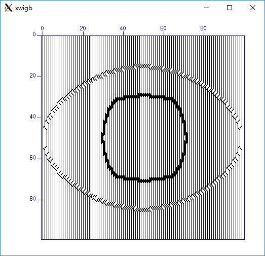

# Madagascar Software
## Get your own open source code from madagascar
### For Example
* sfkine2dvti
```shell
NAME
        sfkine2dvti
DESCRIPTION
        2-D two-components wavefield modeling using pseudo-pure mode P-wave equation in VTI media.
SOURCE
        user/chengjb/Mkine2dvti.c
VERSION
        1.8-svn
```
* You can find it in sfkine2dvti directory. Result as follows:
* 


### You can get the whole directory in ZIP file if there is some file missing in directory.
