# Software Introduction
## You can get the whole diretory&files in "ALL.zip"
## Diretory tree in file "DirTree.md"
## Compiled & RUN: 
```shell
$ make # or
$ sh Compile.sh
```
## Software GUI
* Main Window
* 
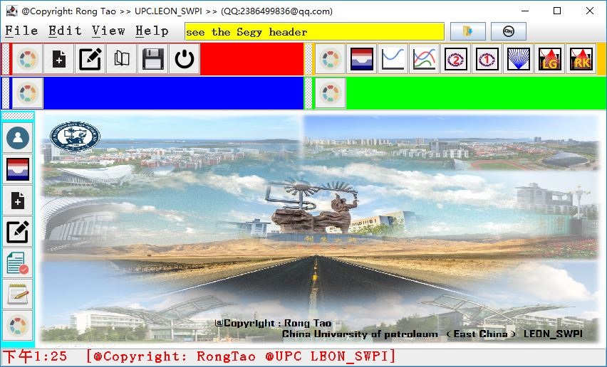
* Buttons (from left to right)
* New Text
* 
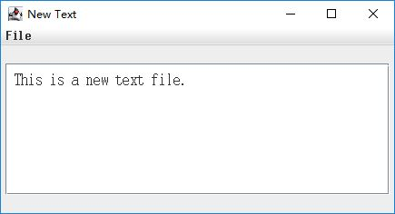
* New Text with Edit
* 
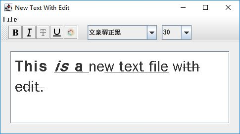
* Open Text
* 
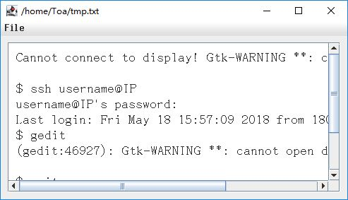
* show a binary file into a picture
* 
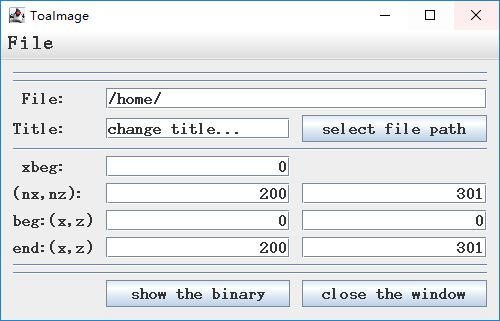
* in the next two is drawing ling and lines, pass it
* the next tow is Finite Difference (VTI media), for example
* 
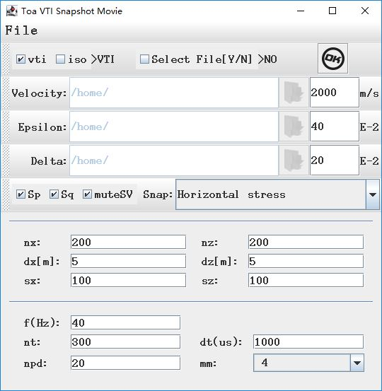
* it result:
* 
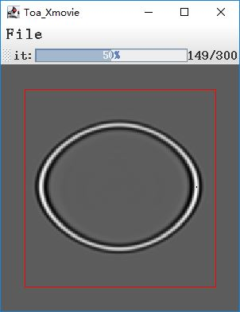
* the next two is Ray tracing(isotropic and anisotropic)
* 
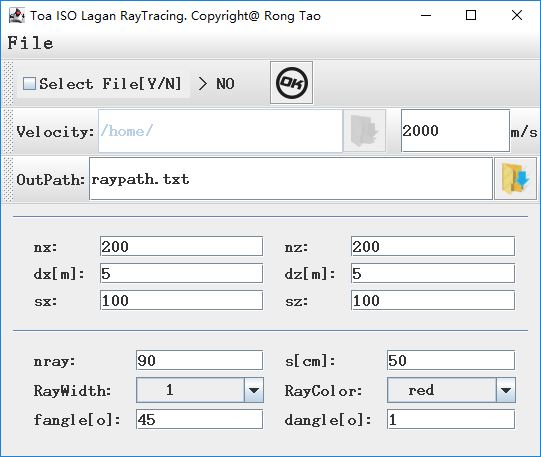
* result 1: velocity is constant value
* 
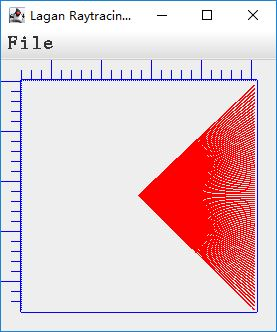
* result 2: velocity is not constant
* 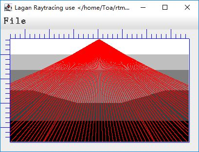
## Vertical Tool Bar
* first one is author (RongTao) introduction
* 
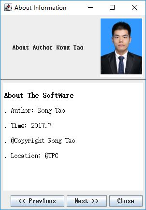
